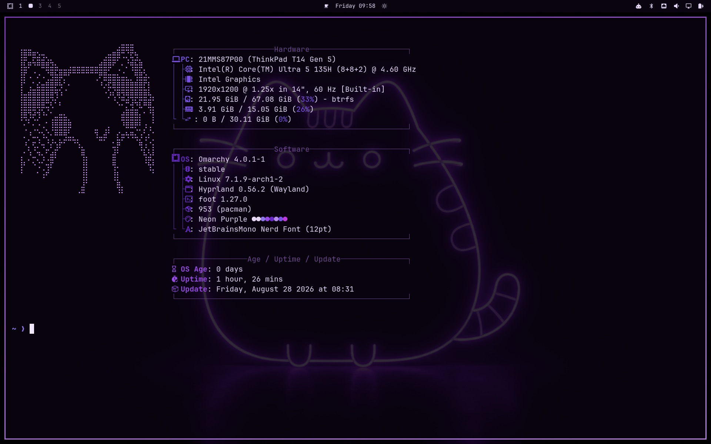
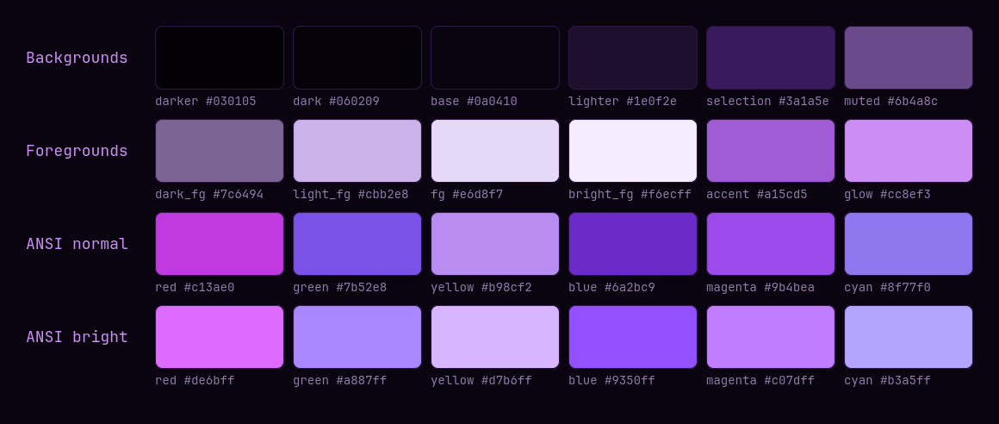
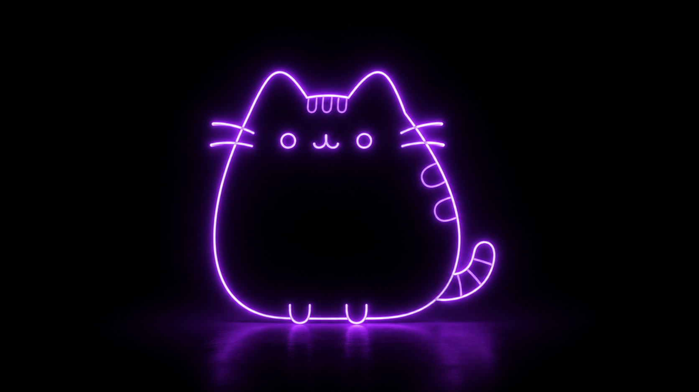

# Neon Purple

An [Omarchy](https://omarchy.org/) theme built from a neon Pusheen wallpaper — near-black
surfaces with a violet glow on top. Every ANSI slot lives in the purple family;
nothing green, red, or blue survives.



## Palette



Colours were sampled from the wallpaper itself. The deepest purple in the image
(`#0a0410`) became the terminal background, and the glow around the cat
(`#8f39d0` → `#cc8ef3`) became the accent and the Hyprland border gradient.

Foreground on background is **14.97:1** — comfortably past WCAG AAA.

Because hue can no longer separate the ANSI slots, **lightness does the work
instead**: the eight colours step from deep violet `#6a2bc9` up to pale lilac
`#d7b6ff`. Errors stay the most saturated colour in the set (`#c13ae0`), so
`git diff` and compiler output are still scannable — you read them as
light-vs-dark purple rather than red-vs-green.

## Wallpaper

The theme ships the wallpaper it was sampled from, and Omarchy sets it when the
theme is applied.



## Install

```bash
omarchy theme install https://github.com/andreinita21/omarchy-neon-purple
omarchy theme set "Neon Purple"
```

Or clone it by hand:

```bash
git clone https://github.com/andreinita21/omarchy-neon-purple \
  ~/.config/omarchy/themes/neon-purple
omarchy theme set "Neon Purple"
```

## What's in the theme

| File | Purpose |
| --- | --- |
| `colors.toml` | The palette. Everything else Omarchy themes is generated from this. |
| `claude.json` | Claude Code theme. Hand-written — see note below. |
| `chromium.theme` | Chromium's `BrowserThemeColor` seed — Chrome's Violet, dark (`#231c2f`). |
| `icons.theme` | `Yaru-purple`. |
| `neovim.lua` | Catppuccin Mocha with the full palette overridden. |
| `vscode.json` | Catppuccin Mocha. |
| `backgrounds/` | The wallpaper. |
| `preview.png` | Thumbnail shown in `omarchy theme` picker. |

Alacritty, foot, kitty, ghostty, btop, helix, obsidian, the Omarchy shell and the
keyboard RGB are all generated from `colors.toml` by Omarchy's own templates, so
they need no files here.

### Why `claude.json` and `chromium.theme` are hand-written

Omarchy generates both from templates, but the generated versions were wrong for
this theme:

- **`claude.json`** — the template derives its neutrals with `mix accent foreground`,
  a plain RGB blend that lands in **grey**. On a palette this saturated that leaked
  grey into the UI chrome (`inactive` came out `#8e839b`). The hand-written version
  keeps every value in the purple family, and raises `permission` from the
  template's `blue` (`#6a2bc9`, too dark to read) to `#9350ff`.
- **`chromium.theme`** — the template seeds it with `background`. Chromium expands
  that seed across its whole tonal palette, so even a near-black purple produced a
  very purple browser frame. This ships Chrome's own built-in **Violet**, in its
  dark rendering: `#231c2f`, RGB `35,28,47`.

  Chrome's Violet swatch is seeded with `#e5d5fc` — the `IDS_NTP_COLORS_VIOLET`
  entry in `kDynamicCustomizeChromeColors`
  (`chrome/browser/ui/webui/cr_components/theme_color_picker/customize_chrome_colors.cc`),
  variant `kTonalSpot`. Seeding with `#231c2f` gives a byte-identical result,
  because `SchemeTonalSpot` keeps only the seed's **hue** and fixes every
  palette's chroma itself — both hexes sit at hue ≈ 303 in HCT. The dark hex is
  shipped because it's the colour you actually see: the frame resolves through
  `kColorFrameActive` → `kColorSysHeader` → `kColorRefSecondary12` (dark, themed)
  → `#231c2f`.

`omarchy-theme-set-templates` skips any file a theme already provides, so both
survive `omarchy update`.

## Extras

Not part of the theme proper — Omarchy doesn't template these — but they're what
make the rest of the desktop match. Copy them by hand.

### `extras/gtk-4.0/gtk.css`

Deep black + purple accents for Nautilus and other GTK4/libadwaita apps. Omarchy
only sets `prefer-dark` and the icon theme, so GTK otherwise stays default grey.

```bash
cp extras/gtk-4.0/gtk.css ~/.config/gtk-4.0/gtk.css
gsettings set org.gnome.desktop.interface accent-color 'purple'
nautilus -q   # restart to pick it up
```

Applies to every GTK4 app, not just the file manager — there's no per-app GTK CSS.

### `extras/fastfetch/`

Three braille ASCII arts and a fastfetch config that renders them in `#cc8ef3`.

```bash
mkdir -p ~/.config/fastfetch
cp -r extras/fastfetch/logos ~/.config/fastfetch/
cp extras/fastfetch/config.jsonc ~/.config/fastfetch/
```

To rotate through them at random on every run, add this to `~/.bashrc`:

```bash
fastfetch() {
  local logos=(~/.config/fastfetch/logos/*.txt)
  if [[ -e ${logos[0]} ]]; then
    command fastfetch --logo-type file --logo "${logos[RANDOM % ${#logos[@]}]}" "$@"
  else
    command fastfetch "$@"
  fi
}
```

fastfetch has no `command` logo type, so the randomising has to live in the shell
rather than in `config.jsonc`. Put a bare `fastfetch` call after the function to
greet every new terminal.

Each line in the art files starts with `$1` — that's fastfetch's colour
placeholder. Without it the art prints in your default foreground instead of purple.

#### The art

```
⠀⠀⠀⠀⠀⠀⠀⠀⠀⠀⠀⠀⠀⠀⠀⠀⠀⠀⠀⠀⠀⠀⠀⠀⠀⠀⠀⠀⣠⣤⡀⠀⠀⠀⠀⠀⠀⠀⣀⣀⡀⠀⠀⠀⠀⠀⠀⠀
⠀⠀⠀⠀⠀⠀⠀⠀⠀⠀⠀⠀⠀⠀⠀⠀⠀⠀⢀⣀⣀⣀⡀⠀⠀⠀⢀⣾⠋⠉⢿⣆⠀⠀⠀⠀⢀⣾⠟⠙⢿⣄⠀⠀⠀⠀⠀⠀
⠀⠀⠀⠀⠀⠀⠀⠀⠀⠀⠀⠀⠀⣀⣤⣶⢿⣿⢻⡛⠛⢛⡟⠛⠛⠿⠿⠃⠀⠀⠀⠻⣿⢿⣿⢿⣿⠁⠀⠀⠀⢻⡆⠀⠀⠀⠀⠀
⠀⠀⠀⠀⠀⠀⠀⠀⠀⠀⢀⣴⡾⠋⠫⣀⡠⠃⠀⠑⠶⠚⣥⣀⣀⡀⠀⠀⠀⠀⠀⠀⠋⠀⠋⠈⠋⠀⠀⠀⠀⠈⣿⡀⣀⣀⣀⡀
⠀⠀⠀⠀⠀⠀⠀⠀⠀⣠⡾⠋⠀⠀⠀⠀⠀⠀⠀⠀⠀⠀⠉⣉⣉⣛⠃⠀⠀⣴⣦⠀⠀⠀⣦⠀⠀⢠⣶⡄⠀⠀⢸⣟⠛⠉⠉⠁
⢰⣿⣿⣦⠀⠀⠀⠀⣰⡟⠀⠀⠀⠀⠀⠀⠀⠀⠀⠀⠀⠀⠛⠛⠛⠛⠃⠀⠀⠛⠛⠀⠘⠿⠻⠟⠀⠘⠛⠃⠀⠀⠈⣿⠛⠛⠛⠃
⢸⣯⠟⠛⣷⡀⠀⢠⡿⠀⠀⠀⠀⠀⠀⠀⠀⠀⠀⠀⠀⠀⠀⠀⠀⠀⠀⠀⠀⠀⠀⠀⠀⠀⠀⠀⠀⠀⠀⠀⠀⠀⠀⢸⡇⠀⠀⠀
⠀⠹⣧⣴⣿⡿⢶⣾⠃⠀⠀⠀⠀⠀⠀⠀⠀⠀⠀⠀⠀⠀⠀⠀⠀⠀⠀⠀⠀⠀⠀⠀⠀⠀⠀⠀⠀⠀⠀⠀⠀⠀⠀⢸⣇⠀⠀⠀
⠀⠀⠘⢿⣮⡀⡞⢹⠀⠀⠀⠀⠀⠀⠀⠀⠀⠀⠀⠀⠀⠀⠀⠀⠀⠀⠀⠀⠀⠀⠀⠀⠀⠀⠀⠀⠀⠀⠀⠀⠀⠀⠀⠀⣿⠀⠀⠀
⠀⠀⠀⠀⠈⠛⢿⣾⠀⠀⠀⠀⠀⠀⠀⠀⠀⠀⠀⠀⠀⠀⠀⠀⠀⠀⠀⠀⠀⠀⠀⠀⠀⠀⠀⠀⠀⠀⠀⠀⠀⠀⠀⠀⣿⠀⠀⠀
⠀⠀⠀⠀⠀⠀⠀⣿⠀⠀⠀⠀⠀⠀⠀⠀⠀⠀⠀⠀⠀⠀⠀⠀⠀⠀⠀⠀⠀⠀⠀⠀⠀⠀⠀⠀⠀⠀⠀⠀⠀⠀⠀⠀⣿⠀⠀⠀
⠀⠀⠀⠀⠀⠀⠀⢹⡇⠀⠀⠀⠀⠀⠀⠀⠀⠀⠀⠀⠀⠀⠀⠀⠀⠀⠀⠀⠀⠀⠀⠀⠀⠀⠀⠀⠀⠀⠀⠀⠀⠀⠀⢀⣿⠀⠀⠀
⠀⠀⠀⠀⠀⠀⠀⠈⣿⠀⠀⠀⠀⠀⠀⠀⠀⠀⠀⠀⠀⠀⠀⠀⠀⠀⠀⠀⠀⠀⠀⠀⠀⠀⠀⠀⠀⠀⠀⠀⠀⠀⠀⢸⡇⠀⠀⠀
⠀⠀⠀⠀⠀⠀⠀⠀⠹⣧⠀⠀⠀⠀⠀⠀⠀⠀⠀⠀⠀⠀⠀⠀⠀⠀⠀⠀⠀⠀⠀⠀⠀⠀⠀⠀⠀⠀⠀⠀⠀⠀⢠⡿⠁⠀⠀⠀
⠀⠀⠀⠀⠀⠀⠀⠀⠀⠻⣦⡀⠀⠀⠀⠀⠀⠀⠀⠀⠀⠀⠀⠀⠀⠀⠀⠀⠀⠀⠀⠀⠀⠀⠀⠀⠀⠀⠀⠀⢀⣰⡟⠁⠀⠀⠀⠀
⠀⠀⠀⠀⠀⠀⠀⠀⠀⠀⠙⢷⣄⠀⠀⠀⠀⠀⠀⠀⠀⠀⠀⠀⠀⠀⠀⠀⠀⠀⠀⠀⠀⠀⠀⠀⠀⠀⢀⣤⡾⠋⠀⠀⠀⠀⠀⠀
⠀⠀⠀⠀⠀⠀⠀⠀⠀⠀⠀⠀⣿⣤⡿⠛⠛⠛⠛⢿⣤⣿⠛⠛⠛⠛⠛⠛⠛⢿⣤⣾⠛⠛⠛⠛⠻⣧⣼⡏⠀⠀⠀⠀⠀⠀⠀⠀
⠀⠀⠀⠀⠀⠀⠀⠀⠀⠀⠀⠀⠈⠉⠀⠀⠀⠀⠀⠀⠉⠁⠀⠀⠀⠀⠀⠀⠀⠀⠉⠁⠀⠀⠀⠀⠀⠉⠉⠀⠀⠀⠀⠀⠀⠀⠀⠀
```

```
⠀⠀⠀⠀⠀⠀⠀⠀⠀⠀⠀⠀⠀⠀⠀⠀⠀⠀⠀⠀⠀⠀⠀⠀⠀⠀⢀⣴⣿⣿⡷⣄⠀⠀⠀⠀⠀⠀⠀⠀⠀⠀⠀⠀⠀⠀⠀⠀⠀⠀⠀⠀⠀⠀⠀⠀⠀⠀⠀⠀⠀⠀⠀⠀⠀
⠀⠀⠀⠀⠀⠀⠀⠀⠀⠀⠀⠀⠀⠀⠀⠀⠀⠀⠀⠀⠀⠀⠀⠀⢀⣴⣿⡿⠋⠈⠻⣮⣳⡀⠀⠀⠀⠀⠀⠀⠀⠀⠀⠀⠀⠀⠀⠀⠀⠀⠀⠀⠀⠀⠀⠀⠀⠀⠀⠀⠀⠀⠀⠀⠀
⠀⠀⠀⠀⠀⠀⠀⠀⠀⠀⠀⠀⠀⠀⠀⠀⠀⠀⠀⠀⠀⢀⣠⣴⣾⡿⠋⠀⠀⠀⠀⠙⣿⣿⣤⣀⡀⠀⠀⠀⠀⠀⠀⠀⠀⠀⠀⠀⠀⠀⠀⠀⠀⠀⠀⠀⠀⠀⠀⠀⠀⠀⠀⠀⠀
⠀⠀⠀⠀⠀⠀⠀⠀⠀⠀⠀⠀⠀⠀⠀⠀⠀⢀⣤⣶⣿⡿⠟⠛⠉⠀⠀⠀⠀⠀⠀⠀⠈⠛⠛⠿⠿⣿⣷⣶⣤⣄⣀⠀⠀⠀⠀⠀⠀⠀⠀⠀⠀⠀⠀⠀⠀⠀⠀⠀⠀⠀⠀⠀⠀
⠀⠀⠀⠀⠀⠀⠀⠀⠀⠀⠀⠀⠀⠀⣠⣴⣾⡿⠟⠋⠁⠀⠀⠀⠀⠀⠀⠀⠀⠀⠀⠀⠀⠀⠀⠀⠀⠀⠈⠉⠛⠻⠿⣿⣶⣦⣄⡀⠀⠀⠀⠀⠀⠀⠀⠀⠀⠀⠀⠀⠀⠀⠀⠀⠀
⠀⠀⠀⣀⣠⣤⣤⣀⡀⠀⠀⣀⣴⣿⡿⠛⠁⠀⠀⠀⠀⠀⠀⠀⠀⠀⠀⠀⠀⠀⠀⠀⠀⠀⠀⠀⠀⠀⠀⠀⠀⠀⠀⠀⠉⠛⠿⣿⣷⣦⣄⡀⠀⠀⠀⠀⠀⠀⠀⢀⣀⣤⣄⠀⠀
⢀⣤⣾⡿⠟⠛⠛⢿⣿⣶⣾⣿⠟⠉⠀⠀⠀⠀⠀⠀⠀⠀⠀⠀⠀⠀⠀⠀⠀⠀⠀⠀⠀⠀⠀⠀⠀⠀⠀⠀⠀⠀⠀⠀⠀⠀⠀⠀⠉⠛⠿⣿⣷⣦⣀⣀⣤⣶⣿⡿⠿⢿⣿⡀⠀
⣿⣿⠏⠀⢰⡆⠀⠀⠉⢿⣿⡀⠀⠀⠀⠀⠀⠀⠀⠀⠀⠀⠀⠀⠀⠀⠀⠀⠀⠀⠀⠀⠀⠀⠀⠀⠀⠀⠀⠀⠀⠀⠀⠀⠀⠀⠀⠀⠀⠀⠀⠀⠙⠻⢿⡿⠟⠋⠁⠀⠀⢸⣿⠇⠀
⣿⡟⠀⣀⠈⣀⡀⠒⠃⠀⠙⣿⡆⠀⠀⠀⠀⠀⠀⠀⣀⡀⠀⠀⠀⠀⠀⠀⠀⠀⠀⠀⠀⠀⠀⠀⠀⠀⠀⠀⠀⠀⠀⠀⠀⠀⠀⠀⠀⠀⠀⠀⠀⠀⠀⠀⠀⠀⠀⠀⠀⢸⣿⠇⠀
⣿⡇⠀⠛⢠⡋⢙⡆⠀⠀⠀⠀⠀⠀⠀⠀⠀⠀⠀⣾⣿⣿⠄⠀⠀⠀⠀⠀⠀⠀⠀⠀⠀⠀⠀⠀⠀⠀⠀⠀⠀⠀⠀⠀⠀⠀⠀⠀⠀⠀⠀⠀⠀⠀⠀⠀⠀⠀⠀⠀⠀⣿⣿⠀⠀
⣿⣧⠀⠀⠀⠓⠛⠁⠀⠀⠀⠀⠀⠀⠀⠀⠀⠀⠀⠘⠛⠋⠀⠀⢸⣧⣤⣤⣶⡀⠀⠀⠀⠀⠀⠀⠀⠀⠀⠀⠀⠀⠀⠀⠀⠀⠀⠀⠀⠀⠀⠀⠀⠀⠀⠀⠀⠀⠀⠀⢰⣿⡿⠀⠀
⣿⣿⣤⣀⡀⠀⠀⠀⠀⠀⠀⠀⠀⠀⠀⠀⠀⠀⠀⠀⠀⠀⠀⠀⠀⠉⠉⠉⠻⣷⣶⣶⡆⠀⠀⠀⠀⠀⠀⠀⠀⠀⠀⠀⠀⠀⠀⠀⠀⠀⠀⠀⠀⠀⠀⠀⠀⠀⠀⢀⣿⣿⠁⠀⠀
⠈⠛⠻⠿⢿⣿⣷⣶⣦⣤⣄⣀⡀⠀⠀⠀⠀⠀⠀⠀⠀⠀⠀⠀⠀⠀⠀⠀⠀⠀⠀⠀⠀⠀⠀⠀⠀⠀⠀⣴⣿⣷⠀⠀⠀⠀⠀⠀⠀⠀⠀⠀⠀⠀⠀⠀⠀⠀⠀⣾⣿⡏⠀⠀⠀
⠀⠀⠀⠀⠀⠀⠀⠉⠙⠛⠻⠿⢿⣿⣷⣶⣦⣤⣄⣀⡀⠀⠀⠀⠀⠀⠀⠀⠀⠀⠀⠀⠀⠀⠀⠀⠀⠀⠀⠙⠿⠛⠀⠀⠀⠀⠀⠀⠀⠀⠀⠀⠀⠀⠀⠀⠀⠀⠀⠘⢿⣿⡄⠀⠀
⠀⠀⠀⠀⠀⠀⠀⠀⠀⠀⠀⠀⠀⠀⠈⠉⠙⠛⠻⠿⢿⣿⣷⣶⣦⣤⣄⣀⡀⠀⠀⠀⠀⠀⠀⠀⠀⠀⠀⠀⠀⠀⠀⠀⠀⠀⠀⠀⠀⠀⠀⠀⠀⠀⠀⠀⠀⠀⠀⠀⠈⢿⣿⡄⠀
⠀⠀⠀⠀⠀⠀⠀⠀⠀⠀⠀⠀⠀⠀⠀⠀⠀⠀⠀⠀⠀⠀⠀⠉⠉⠛⠛⠿⠿⣿⣷⣶⣶⣤⣤⣀⡀⠀⠀⠀⢀⣴⡆⠀⠀⠀⠀⠀⠀⠀⠀⠀⠀⠀⠀⠀⠀⠀⠀⠀⠀⠈⢿⡿⣄
⠀⠀⠀⠀⠀⠀⠀⠀⠀⠀⠀⠀⠀⠀⠀⠀⠀⠀⠀⠀⠀⠀⠀⠀⠀⠀⠀⠀⠀⠀⠀⠉⠉⠛⠛⠿⠿⣿⣷⣶⡿⠋⠀⠀⠀⠀⠀⠀⠀⠀⠀⠀⠀⠀⠀⠀⠀⠀⠀⠀⠀⠀⠈⣿⣹
⠀⠀⠀⠀⠀⠀⠀⠀⠀⠀⠀⠀⠀⠀⠀⠀⠀⠀⠀⠀⠀⠀⠀⠀⠀⠀⠀⠀⠀⠀⠀⠀⠀⠀⠀⠀⠀⠀⣿⣿⠃⠀⠀⠀⠀⠀⠀⠀⠀⠀⠀⠀⠀⠀⢀⣀⣀⠀⠀⠀⠀⠀⠀⢸⣧
⠀⠀⠀⠀⠀⠀⠀⠀⠀⠀⠀⠀⠀⠀⠀⠀⠀⠀⠀⠀⠀⠀⠀⠀⠀⠀⠀⠀⠀⠀⠀⠀⠀⠀⠀⠀⠀⠀⢻⣿⣆⠀⠀⠀⠀⠀⠀⢀⣀⣠⣤⣶⣾⣿⣿⣿⣿⣤⣄⣀⡀⠀⠀⠀⣿
⠀⠀⠀⠀⠀⠀⠀⠀⠀⠀⠀⠀⠀⠀⠀⠀⠀⠀⠀⠀⠀⠀⠀⠀⠀⠀⠀⠀⠀⠀⠀⠀⠀⠀⠀⠀⠀⠀⠈⠻⢿⣻⣷⣶⣾⣿⣿⡿⢯⣛⣛⡋⠁⠀⠀⠉⠙⠛⠛⠿⣿⣿⡷⣶⣿
```

```
⣤⣤⣄⣀⠀⠀⠀⠀⠀⠀⠀⠀⠀⠀⠀⠀⠀⠀⠀⠀⢀⣠⣾⡿⣿⣇⠀⠀⠀⠀
⣿⢏⣹⣳⣯⣗⣤⡀⠀⠀⠀⠀⠀⠀⠀⠀⠀⠀⣠⣾⣿⡿⠃⠒⣜⣮⢧⡀⠀⠀
⣿⡞⠁⡉⠙⠻⣷⣿⢦⣤⣤⣶⣶⣶⣶⣶⣶⣾⣿⡿⠋⠀⠌⡐⠈⢿⣿⣣⠀⠀
⣿⠀⢂⠐⡁⢂⣬⣿⣿⢫⠉⠀⠀⠀⠀⠀⠀⠜⡹⢿⣿⣿⣶⣶⣤⣈⣿⣷⣗⠀
⡇⢀⣦⣼⣾⣿⣿⣿⡭⡃⠌⠀⠀⠀⠀⠀⠀⠀⠑⡹⣚⢿⣿⣿⣿⣿⣿⣿⣼⠀
⣿⣿⣿⣿⣿⣿⣟⢧⢃⠁⠀⠀⠀⠀⠀⠀⠀⠀⠀⠐⠉⢎⠳⢯⡟⣿⣻⢿⣯⡷
⣿⣿⡿⣟⡿⡓⢎⠂⠈⠀⠀⠀⠀⠀⠀⠀⠀⠀⠀⠀⠀⠀⠉⣰⣬⣧⡝⢊⠙⣷
⠟⢧⠛⠥⠃⢉⠀⣴⣾⣿⣦⡀⠀⠀⠀⠀⠀⠀⠀⠀⠀⠀⠸⣿⣿⣿⣿⠀⠀⢸
⠈⠄⡈⠤⣁⠢⡀⢿⣿⣿⣿⠃⠀⠀⠀⠀⢠⡄⠀⣴⠀⠀⡀⢙⢛⡛⠭⢠⠃⢆
⠐⡠⢑⡒⡄⠓⡌⣌⢩⣩⠷⠶⣤⠀⠀⠀⠀⠳⠾⠃⢀⢸⡼⠋⠋⠛⢦⡃⠞⡠
⢀⠱⡈⢖⡈⢣⠜⣠⠟⠀⠀⠀⠀⢳⡄⠀⠀⠀⠀⠀⠐⣾⠁⠀⠀⠀⠈⢧⢣⢸
⣆⠠⢑⠢⣉⠆⢼⡟⠀⠀⠀⠀⠀⠈⣷⠀⠀⠀⠀⠀⢸⡇⠀⠀⠀⠀⠀⠈⣷⢯
⡏⠀⠀⢁⠂⢌⡟⠀⠀⠀⠀⠀⠀⠀⣿⠀⠀⠀⠀⠀⠈⣗⠀⠀⠀⠀⠀⠀⠈⢯
⠀⠀⠀⠀⠀⠋⠀⠀⠀⠀⠀⠀⠀⠀⣿⠀⠀⠀⠀⠀⠀⢿⡀⠀⠀⠀⠀⠀⠀⠀
⠀⠀⠀⠀⠀⠀⠀⠀⠀⠀⠀⠀⠀⣰⡇⠀⠀⠀⠀⠀⠀⠘⣷⠀⠀⠀⠀⠀⠀⠀
```

### Terminal transparency

Not shipped as a file, since it lives in your terminal config rather than the
theme. For foot (note: `alpha` moved into `[colors-dark]` in foot 1.27 — using a
bare `[colors]` section prints a deprecation warning):

```ini
[colors-dark]
alpha=0.85
```

Alacritty `opacity = 0.85`, kitty `background_opacity 0.85`,
ghostty `background-opacity = 0.85`.

## Caveats

- **Installing via `omarchy theme install` drops `neovim.lua` and `vscode.json`.**
  Omarchy strips any `*.lua` and `vscode.json` from a theme cloned from a git repo,
  because those run code. The theme still works — Omarchy regenerates both from
  `colors.toml` — you just lose the hand-tuned Catppuccin overrides. Clone it into
  `~/.config/omarchy/themes/` by hand if you want them.
- **Everything is purple**, including terminal green and yellow. That's the point,
  but it does mean `git diff` reads as light-vs-dark rather than green-vs-red.
- The wallpaper is a neon Pusheen render collected from the web, included here so
  the theme installs complete. It isn't my artwork.

## Licence

Theme files are MIT. The wallpaper is not mine to license — see the caveat above.

### `extras/chromium/set-dark-mode.sh`

Pins Chromium to **Dark** mode, so the Violet theme renders as the dark frame
rather than following the system and flipping to `#eadef7` in light mode.

Omarchy writes `{"BrowserThemeColor": ..., "BrowserColorScheme": "device"}` into
the managed-policy dir, but **`BrowserColorScheme` is not a Chrome policy** —
`BrowserThemeColor` is the only theme policy Chromium defines, so the key is
silently ignored. The real switch is the profile pref
`browser.theme.color_scheme2` (`kBrowserColorScheme`), with
`ThemeService::BrowserColorScheme` values `kSystem=0`, `kLight=1`, `kDark=2`.

```bash
# Chromium rewrites Preferences on exit, so close it completely first.
extras/chromium/set-dark-mode.sh
```

It backs up each `Preferences` it touches, is idempotent, and refuses to run
while Chromium is up.
